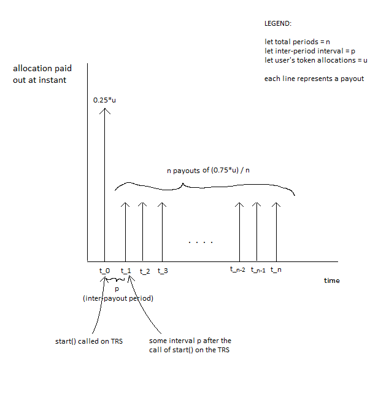

Technical overview of the sales mechanics, this document is intended to give context to the position of each contract in the overall sales system. This is intended for auditors to gain context about the role of each contract.

# High-Level

This set of contracts are the on-chain component of the pre-sale system. The role of this system is to gather value (Ether) from interested buyers (``Receiver.sol``, ``Sale.sol``). Once the ether has been collected, tokens are manually minted (according to sales mechanics) through an off-chain mechanism and stored into the ERC20 contract (``Token.sol``, ``Controller.sol``, ``Ledger.sol``). Note that several parties are involved in the sales process, and dependant on each party the exact mechanism for token minting and storage may differ. Refer to the flowcharts included for descriptions about each party.

Post minting, the tokens are then redistributed according to the _intention_ of each buyer. The token can either be immediately available, or stored into savings contracts (``Savings.sol``) that release the schedule token releases on a periodic basis over $n$ periods, in the flowcharts these are referred to as **TRS**.

We begin starting from the most user-facing contracts: ``Receiver.sol`` and ``Sale.sol``

# Receiver.sol & Sale.sol

These two contracts composes our value collection system, ether is collected through the public interface (``Receiver.sol``) and transported into ``Sale.sol``. There are a total of $k := [1, 3]$ receivers, backed by a single sales contract. A user selects which of the receiver contracts to transfer ether to depending the _intention_ of the user (we will get to that later).

Each receiver will emit a ``EtherIn`` event, that is picked up by an off chain system (Scraping Script) and collected into a manifest $M$, while the value is stored inside ``Sale.sol``.

The specifics of the sales contracts work as follows: 

* There are two value caps, a softcap and a hardcap (cap).
* The sales contract should _only_ receive ether from the receiver contracts.
* The sales contract should first be initialized ``init``, at which point the starting and ending timestamps (we are planning for a week) along with the caps should be set. It will then be hooked up to each receiver (and vice versa). 
* The contract state should switch to live upon the _first_ ether deposit. The sale should continue until the softcap is hit, at which point (provided there is enough time remaining) the contract will be rescheduled to end in 4 hours, or when the hardcap is hit.
* The first transaction that reaches over the ``cap`` limit, or is submitted on a block timestamp _after_ ``end`` closes the sale.

Note: we are aware of the possibility of a selfdestruction ether transfer affecting the balance of the sale contract, but we are fine with that possibility as it most likely will not disrupt logic.

# Ledger.sol

Ledger is the state or model of our token, with an important feature being the ``multiMint`` used to mint batches of tokens for accounts, this will be used by the off-chain system to mint the appropriate balances. The ERC20 token will be referenced by $k$ savings (Savings.sol) contracts for purposes of token transfers.

If the _intention_ of the user was to obtain liquid token value, then the process is complete post-minting.

If the _intention_ of the user was to participate in the Savings contracts, then their tokens will be temporarily allocated (in bulk) to special addresses held by us $A = \{addr_1 ... addr_{k-1}\}$.

# Savings.sol

The Savings.sol contracts are responsible for holding tokens and distributing it to the user on a periodic basis. In return for depositing their tokens, the users gain the ability to receive _additional_ tokens as part of the redistribution scheme.

The general operating timeline is follows:

* Contract is live after linking to ERC20 Contract (Token.sol), post minting.
* During the duration in which the contract is unlocked, off-chain business logic will transfer all addresses of $A$ to the correct corresponding Savings contracts, and will then use $M$ to mint the correct deposit balances through ``multiMint`` (this is the multiMint for TRS).
* During the duration in which the contract is unlocked, liquid token users can also deposit to the Savings contracts through ``depositTo``.
* Each contract is ``lock``-ed.
* Each contract is ``start``-ed, initiating the token distribution schedule. This is reflected in the ``withdrawTo`` function.

## withdrawTo(address addr)

This function is either called by us (``bulkWithdraw``) to push new tokens to user accounts, or called by the user individually. The business logic for ``withdrawTo`` should work as follows:

* When ``start`` is called, 25% of the total owed value for each user is unlocked. Meaning that users can call ``withdrawTo`` right away to receive that amount.
* Starting from a block delta, the user receives is able withdraw a certain amount on a monthly basis that splits the remaining 75% evenly over $n$ months.

Presently, we are intending for different periods for Savings contracts, with $n=36$ and $n=12$.

