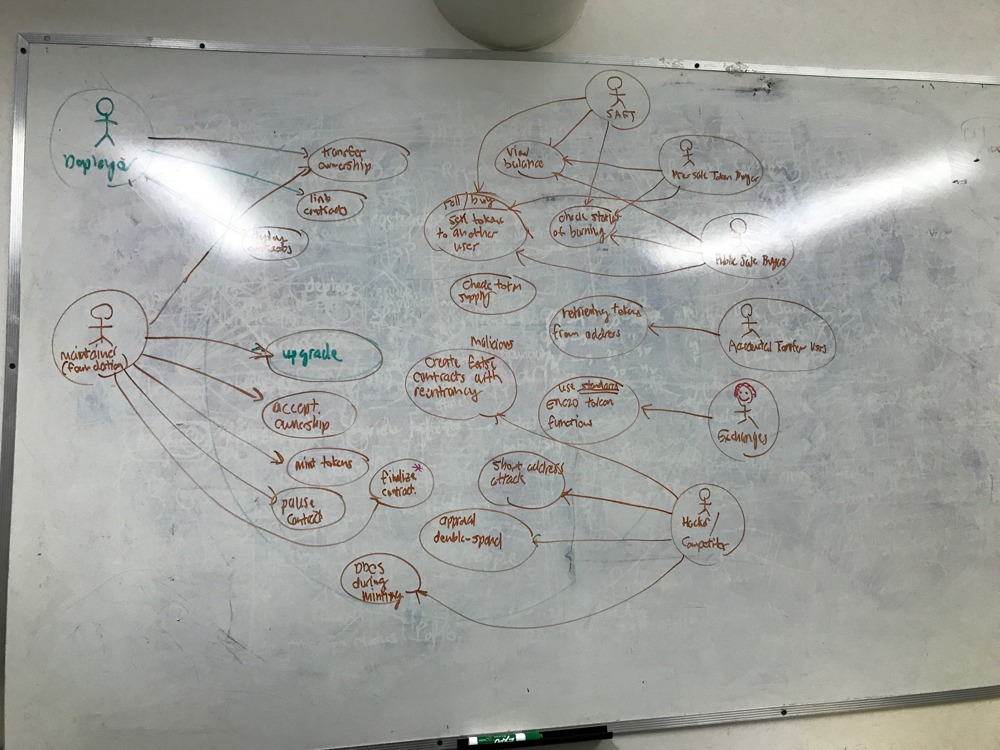

The following are use case definitions initially concluded by the team. Proceeding, we will be designing test cases around the following actors. These are derived from the meeting this afternoon, in which the following actors and their actions were proposed in Figure \ref{actor_definitions}.

# Actors
## Contract Deployers

{width=70%}

Contract Deployers are concerned about the successful deployment of the contract and the eventual transition from deployment to management. This will involve changing the ownership from deployers to managers (foundation or NA). Keep in mind that the ERC20 contract suite is not necessarily owned by one particular account.

They require:

* The successful deployment of contract under possibly strained conditions
* Successful testing of deployment on live network before pre-sale date
* Successful linking of contracts post-deployment
* Successful migration of contract owner from themselves to another party.

Please refer to Figure \ref{deployer_positive_1} for use cases.

## Foundation

The Foundation are the Maintainence crew of the ERC20 Contracts, they are concerned with the successful operation of management tools such as:

* Controller migration
* Ledger migration
* State checking
* Successful Minting

Minting is delegated to a special Minter actor (specified later), however, we assume the foundation is a cautious actor and will verify every step an external actor takes.

They require:

* Successful reception of all contracts from deployer (with state checks included)
* Successful migration from different contract versions
* Successful Minting (with state checks included)
* Successful migration of state sup on a Ledger update

Refer to Figures \ref{foundation_receive}, \ref{foundation_controller_upgrade}, \ref{foundation_upgrade}, for details on use cases.

{width=70%}

## Token Minters

Token Minters are responsible for minting the tokens, their primary concerns are the successful minting of tokens. We can kind of imagine this actor to be New Alchemy's minting script

They require:

* The correct information is delivered from external sources
* The right balance is assigned to the right addresses
* Verify the balances are correct
* The process is not lengthy (does not exceed one day)

Refer to figure \ref{minter}.

## SAFT/Presale/Public Sale Users who Bought (Exchanges Included)

These two parties are users who purchased AION either through a private or public sale, they are effectively the users of the contract and will be interested (potentially) to learn about its functionalities and usability. They will also be interested in buying/selling the Token through exchanges or privately.

They require:

* The stability of the contract 
* The ability to view their balances
* The ability to view the Total Supply
* The ability to transfer tokens from one User to Another
* The ability to provide an allowance to another User
* The ability to check if a Token is active (unpaused)
* The ability to check if a Token is able to be burned (burnable)

Specifically, the exchanges will be interested in verifying that the contract is _honest_, meaning that they will be looking:

* To scrape the contract for all transactions/burning any event that can generate a change in value
* To verify that the totalySupply of the contract is honest with the liquid value
* To identify which wallets have what amount of balance
* To verify that the wallet follows ERC20 compatibility

Refer to Figure \ref{exchange}, \ref{burn}.

## Accidental Transfer User

The accidental transfer user is a user that has accidentally transferred tokens to _our_ contract address on _their_ respective contracts. In this scenario they need:

* To be able to prove to us that they accidentally transferred value to us
* To provide value for us to transfer value back to them
* For us to manually execute a transfer in _their_ contract.

Refer to Figure \ref{accidental}.

## SAFT & Presale Users who utilizes TRS

These two parties are the _users_ of the contract, they will be interested in reviewing that their stored amounts are correct, and that the payout is correct. They need to be able to:

* Call the TRS contract to generate tokens
* Query the TRS contract to show next generation point
* Query the TRS account on the contract to see how much tokens in total
* Assert that there are no disrepencies between the TRS contract & its owned token value
* Query their balance once TRS has been achieved (this may be a multi-block process)

Refer to figure \ref{trs_deposit}.

## Malicious Users

This party's intent is to try to negatively impact the the Sales and Token contracts in some way. This can involve the Short Address Attack, Reentrancy, and other Code Exploits. They can also resort to DDOS attacks to affect the sales negatively. They need to be able to (but we're not intending to let them):

* Call the token contract with invalid data allowing for a transfer with greater balance (Short address attack)
* Generate the private key of any contract, and point the contract to an incorrect corresponding address
* At sale time, consume network traffic by DDOSing the network with low-value transactions
